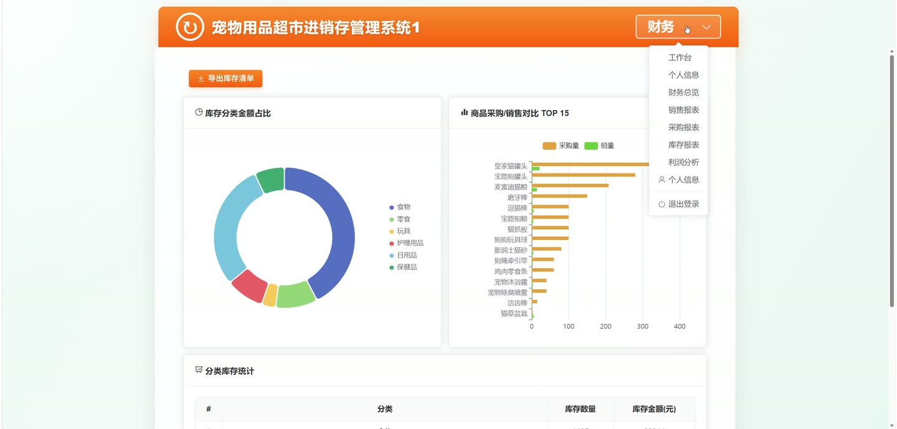
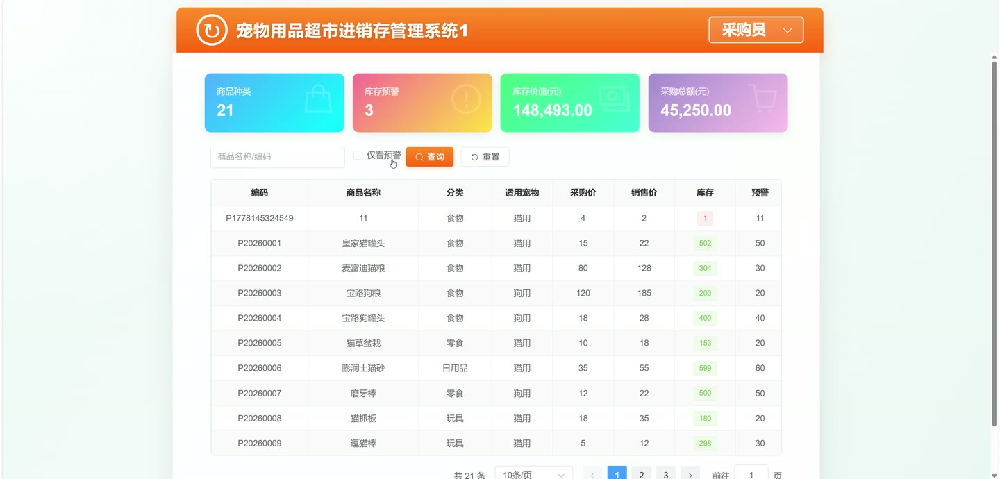

# (附文档)Springboot3+Vue3+MySQL 宠物用品超市进销存管理系统

**技术栈**：Springboot3、Vue3、MySQL

### 系统简介

本系统是一套基于 Spring Boot 3 + Vue 3 + MySQL 的宠物用品超市进销存管理系统，采用前后端分离架构。系统内置管理员、销售员、采购员三个角色，覆盖商品管理、采购入库、销售出库、库存盘点、客户管理、供应商管理、数据备份恢复、数据统计与 Excel 导出等核心业务场景，适用于宠物用品超市的日常运营管理。
 
### 核心功能
 
### 管理员端

 
- 登录/退出系统，支持按角色（ADMIN/SALESPERSON/PURCHASER）登录并获取 JWT Token 
- 查看当前登录用户信息，获取用户 ID、用户名、角色、状态等 
- 用户管理：分页查询非管理员用户列表，支持按关键字/角色/状态筛选；新增、编辑、删除用户 
- 启用/禁用用户：通过接口直接修改用户状态（1启用/0禁用） 
- 重置用户密码：将指定用户密码重置为自定义密码（默认 123456） 
- 修改个人密码：输入旧密码与新密码进行修改 
- 找回密码：通过账号 + 真实姓名 + 手机号三项校验后重置为 123456 
- 修改个人信息：编辑当前登录用户的昵称、手机号、邮箱等字段 
- 系统日志管理：分页查看操作日志，支持按关键字/日志类型/状态筛选；删除单条日志或清空全部日志 
- 系统配置管理：查看/新增/编辑/删除系统配置项；支持批量保存配置；公开接口返回系统名称与默认预警阈值 
- 数据备份：创建数据库备份（生成 .sql 文件），支持添加备注；查看备份列表（文件名/大小/时间/备注） 
- 数据恢复：选择备份文件恢复数据库，自动执行 INSERT 语句 
- 下载备份文件：通过 HTTP 下载备份 .sql 文件 
- 删除备份文件：从服务器删除指定备份
 
### 销售员端

 
- 商品管理：分页查询商品列表，支持按关键字/分类/适用宠物/预警状态筛选；新增、编辑、删除商品 
- 商品编码自动生成：新增商品时自动生成以 "P" 开头的唯一编码 
- 查看库存预警商品：自动筛选库存数量 ≤ 预警阈值的商品列表 
- 客户管理：分页查询客户列表，支持按关键字/会员等级筛选；新增、编辑、删除客户 
- 客户编码自动生成：新增客户时自动生成以 "C" 开头的唯一编码 
- 销售开单：选择商品与客户，填写销售数量与单价，自动计算小计、总额、优惠金额与实收金额 
- 销售单自动扣减库存：创建销售单时校验库存充足并扣减对应商品库存 
- 销售单查询：分页查看销售订单，支持按客户/销售员/状态/时间范围/单号筛选 
- 销售单详情：查看订单基本信息、商品明细（含商品名称/编码/数量/单价/小计） 
- 销售退货：选择销售单与商品，填写退货数量与原因，自动恢复库存并生成退货记录 
- 退货记录查询：分页查看退货记录，支持按操作员/时间范围/单号筛选 
- 个人销售统计：查看当前销售员的销售总额、订单数等数据
 
### 采购员端

 
- 供应商管理：分页查询供应商列表，支持按关键字/状态筛选；新增、编辑、删除供应商 
- 供应商编码自动生成：新增供应商时自动生成以 "S" 开头的唯一编码 
- 采购开单：选择供应商与商品，填写采购数量与单价，自动计算小计与总额 
- 采购单查询：分页查看采购订单，支持按供应商/采购员/状态/时间范围/单号筛选 
- 采购单详情：查看订单基本信息、商品明细（含商品名称/编码/数量/单价/小计） 
- 采购入库：将待入库采购单标记为已入库，自动增加对应商品库存并记录到货时间 
- 取消采购单：将待入库采购单标记为已取消 
- 个人采购统计：查看当前采购员的采购总额、订单数等数据
 
### 公共端（所有角色）

 
- 库存盘点：创建盘点单，自动计算盘盈/盘亏数量并修正库存 
- 盘点记录查询：分页查看盘点单列表，支持按关键字筛选 
- 盘点详情：查看盘点单基本信息及明细（商品名称/账面数量/实盘数量/差异） 
- 仪表盘概览：查看商品总数、库存总量、本月销售额、本月采购额等汇总数据 
- 销售趋势图：按日统计最近 N 天的销售金额与订单数 
- 采购趋势图：按日统计最近 N 天的采购金额与订单数 
- 商品对比分析：查看各商品的采购总额、销售总额与毛利润 
- 热销商品排行：查看销量前 N 的商品列表 
- 滞销商品排行：查看销量最低的 N 个商品列表 
- 供应商采购统计：查看各供应商的采购总额与订单数 
- 库存分类统计：按商品分类统计库存数量与库存金额 
- 利润汇总：查看销售总额、销售成本、毛利润与毛利率 
- Excel 导出：导出商品库存、销售订单、采购订单、利润汇总为 .xlsx 文件 
- 文件上传：上传图片等文件，自动按日期分目录存储并返回访问 URL
 
### 技术栈

 后端框架Spring Boot 3.x ORMMyBatis-Plus 3.5.x 权限认证JWT（自定义 Token 拦截器） 密码加密BCrypt 前端框架Vue 3 状态管理Pinia 前端路由Vue Router 4 UI 组件库Element Plus 构建工具Vite 数据库MySQL 8.x Excel 导出EasyExcel 工具类Hutool
 
### 交付内容

 
- 后端完整源码 
- 前端完整源码 
- 数据库初始化脚本 
- 万字文档

## 界面展示

---

## 获取完整源码 + 万字文档

本仓库为项目介绍页。**完整前后端源码、数据库初始化脚本、万字项目文档**，请加微信 `kangkangcode`，或访问 [codekk.top](http://codekk.top) 获取。

可作课程设计 / 毕业设计参考，支持远程部署调试。